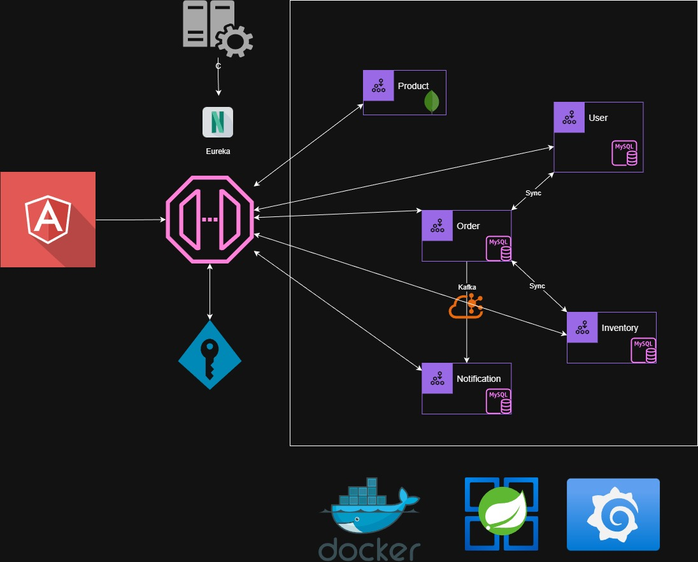

# ShopperMart - Microservices E-Commerce Platform

A modern, scalable e-commerce platform built with microservices architecture using Spring Boot, Docker, and various supporting technologies.

## Project Overview

ShopperMart is a distributed microservices application designed for handling online retail operations. The platform uses service discovery, configuration management, API gateway pattern, and monitoring tools for production-grade reliability.

## Architecture

The project follows a microservices architecture with the following components:



## Microservices

### 1. **Eureka Server**

- Service registry and discovery
- Manages dynamic registration of all microservices
- Port: 8761

### 2. **Config Server**

- Centralized configuration management
- Provides configuration to all services
- Port: 8888

### 3. **API Gateway**

- Entry point for all client requests
- Routes requests to appropriate microservices
- Handles load balancing
- Port: 8080

### 4. **User Service**

- Manages user accounts and authentication
- User registration and login
- Database: MySQL

### 5. **Product Service**

- Manages product catalog
- Product creation, updates, and retrieval
- Database: MongoDB

### 6. **Inventory Service**

- Tracks product stock levels
- Manages inventory operations
- Database: MySQL

### 7. **Order Service**

- Handles order processing and management
- Order creation and tracking
- Database: MySQL

### 8. **Notification Service**

- Sends notifications to users
- Email and message delivery
- Integrates with message brokers

## Technology Stack

### Core Framework

- **Spring Boot** - Microservices framework
- **Spring Cloud** - Distributed system patterns
- **Spring Security** - Authentication and authorization
- **Keycloak** - Identity and access management

### Data & Storage

- **MySQL** - Relational database for user, order, and inventory services
- **MongoDB** - NoSQL database for product service

### Message & Communication

- **RabbitMQ** - Message broker (optional)
- **Kafka** - Event streaming (optional)

### Monitoring & Logging

- **Prometheus** - Metrics collection
- **Grafana** - Visualization dashboard
- **Loki** - Log aggregation
- **Tempo** - Distributed tracing

### Containerization & Orchestration

- **Docker** - Container runtime
- **Docker Compose** - Container orchestration

## Project Structure

```
ShopperMart/
├── eureka-server/              # Service registry
├── config-server/              # Configuration server
├── api-gateway/                # API Gateway
├── user-service/               # User management
├── product-service/            # Product catalog
├── inventory-service/          # Inventory management
├── order-service/              # Order processing
├── notification-service/       # Notifications
├── configs/                    # Configuration files for each service
├── docker/                     # Docker configurations for monitoring tools
├── data/                       # Database persistent data
├── docker-compose-infra.yml    # Infrastructure services
├── docker-compose-services.yml # Microservices
└── pom.xml                     # Root Maven POM
```

##Frontend 
- ** Using Angular - Under Development**

## Prerequisites

- **Java 17+**
- **Maven 3.8+**
- **Docker & Docker Compose**
- **Git**

## Installation & Setup

### 1. Clone the Repository

```bash
git clone https://github.com/ashbirdhiman/ShopperMart.git
cd ShopperMart
```

### 2. Start Infrastructure Services

```powershell
# Start MySQL, MongoDB, Keycloak, Prometheus, Grafana, Loki, Tempo
docker-compose -f docker-compose-infra.yml up -d
```

### 3. Build All Services

```bash
mvn clean install -DskipTests
```

### 4. Start Microservices

```powershell
# Start all microservices
docker-compose -f docker-compose-services.yml up -d
```

Or run individual services:

```bash
# Terminal 1 - Eureka Server
cd eureka-server && mvn spring-boot:run

# Terminal 2 - Config Server
cd config-server && mvn spring-boot:run

# Terminal 3 - API Gateway
cd api-gateway && mvn spring-boot:run

# Terminal 4 - User Service
cd user-service && mvn spring-boot:run

# Terminal 5 - Product Service
cd product-service && mvn spring-boot:run

# Terminal 6 - Inventory Service
cd inventory-service && mvn spring-boot:run

# Terminal 7 - Order Service
cd order-service && mvn spring-boot:run

# Terminal 8 - Notification Service
cd notification-service && mvn spring-boot:run
```

## Service URLs

| Service       | URL                   | Port |
| ------------- | --------------------- | ---- |
| API Gateway   | http://localhost:8080 | 8080 |
| Eureka Server | http://localhost:8761 | 8761 |
| Config Server | http://localhost:8888 | 8888 |
| Keycloak      | http://localhost:8180 | 8180 |
| Prometheus    | http://localhost:9090 | 9090 |
| Grafana       | http://localhost:3000 | 3000 |

## Database Initialization

Run the data population script:

```powershell
./populate-all-data.ps1
```

## Monitoring & Observability

### Prometheus

- Access: http://localhost:9090
- Collects metrics from all services

### Grafana

- Access: http://localhost:3000
- Default credentials: admin/admin
- Visualizes metrics from Prometheus

### Loki

- Integrated log aggregation
- Accessible through Grafana

## API Documentation

API documentation is available at the API Gateway. Visit http://localhost:8080/swagger-ui.html for Swagger UI (if Springdoc is configured).

## Configuration

All service configurations are managed through the Config Server and stored in the `configs/` directory:

- `application.yml` - Default configuration
- `application-dev.yml` - Development environment
- Service-specific configurations for each microservice

## Troubleshooting

### Services not registering with Eureka

- Ensure Eureka Server is running on port 8761
- Check service configuration for Eureka client settings

### Database connection issues

- Verify MySQL and MongoDB containers are running
- Check database credentials in configuration files

### Port conflicts

- Ensure required ports (8080, 8761, 8888, etc.) are available
- Modify port mappings in docker-compose files if needed

## Development

### Building Individual Services

```bash
cd <service-name>
mvn clean install
```

### Running Tests

```bash
mvn test
```

### Code Quality

- Code should follow Spring Boot best practices
- Use proper exception handling
- Implement comprehensive logging

## Contributing

1. Create a feature branch
2. Make your changes
3. Commit with clear messages
4. Push to your branch
5. Create a pull request

## License

This project is licensed under the MIT License.

## Contact

For issues and questions, please reach out to the development team.

---

**Last Updated:** January 2026
